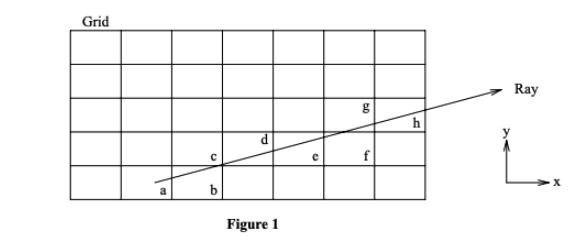
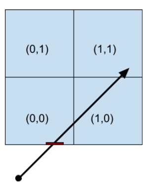
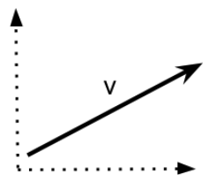
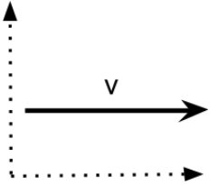
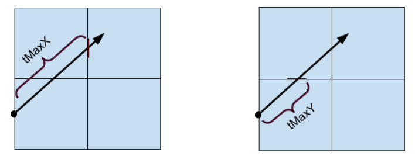
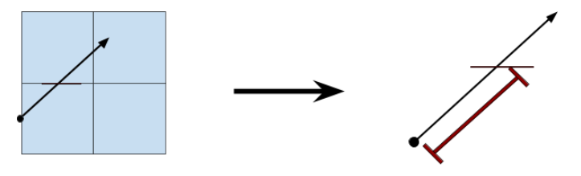

# An Overview of the Fast Voxel Traversal Algorithm

This document serves as an overview of the research paper [Amanatides & Woo “A Fast Voxel Traversal Algorithm For Ray Tracing”](https://www.researchgate.net/publication/2611491_A_Fast_Voxel_Traversal_Algorithm_for_Ray_Tracing). While the paper provides pseudocode and some understanding of its inner-workings, we discovered it lacked depth. Hopefully, this will provide a deeper comprehension of how the algorithm works, as well as how it can be implemented.

## Authors
- Gyurgyik C (cpg49@cornell.edu)
- Kellison A (ak2485@cornell.edu) 


## Pre-requisites
At this point, we assume that you have read the paper, and you’re familiar with [voxels](https://en.wikipedia.org/wiki/Voxel). For simplicity, we are also assuming each voxel in that grid has unit size.

## 2-dimensional case
We’ll begin with the 2-dimensional grid case displayed in Figure 1 of the paper:


Here, we have our ray which is a line described as ```r = u + t * v, t >= 0```. This boundary condition makes sense, since ```t``` is time here. ```u``` is a bounded vector usually referred to as the origin, and ```v``` is the free vector representing the direction of the ray. The goal of this algorithm is to traverse the voxels with minimal floating point operations. The paper breaks it down into two phases: “initialization” and “incremental traversal.”

### Initialization

The first step of the initialization phase is to find the voxel that contains the ray origin, u. There is no requirement that the ray origin is within our grid though. Let’s say then, that we have the following case:



Here, the ray origin is outside our grid. We can clearly see that the ray’s first entrance is into ```Voxel(0,0)```. 
In other words, the ray origin is below ```Voxel(0,0)``` which one might name as ```Voxel(0,-1)```. As discussed in the paper, we can simply take the adjacent voxel which in our case 
is ```Voxel(0,0)```. To calculate entrance, one can use Smit’s algorithm discussed [here](http://www.cse.chalmers.se/edu/course/TDA362/EfficiencyIssuesForRayTracing.pdf). 
A “safer” implementation of this algorithm can be found in the paper [here](http://www.cs.utah.edu/~awilliam/box/box.pdf).

#### Example:
The ray in the image above might be represented as ```r = u + tv``` where ```u = <0,-3/4>``` and ```v = <1, 8/9>```, i.e. ```r```  follows the line ```y = (-3/4)+ (9/8)x```. Thus, ```ray.origin.x = 0``` and ```ray.origin.y = -3/4```. Based on grid (given at initialization) we know that
```
grid.corners =   [(0,0),(0,2),
                  (2,2),(2,0)];
```

Thus, we can determine the boundary at which ```r``` intersects the grid. In particular, we see the ```y = 0``` boundary of the grid is represented by the vector ```r2 = <0,0> + <1,0>t```; solving for ```r2 = r``` yields ```t = 27/32```. Thus, at the annoying value of ```t = 27/32```, the ray ```r``` will intersect the boundary of the grid. Note that this value of ```t``` is the least such value of ```t``` for all boundary crossings. 

From here, based on grid we know that 
```
grid.voxel_list = [(0,0),(1,0),
                   (1,1),(0,1)]
```
and we can determine that the voxel we are located in is ```grid.voxel_list[0]```, or ```Voxel(0,0)```.

### Incremental Traversal
This brings us to our first algorithm, which we’ll uncover one pseudovariable at a time.
```
loop {
  if (tMaxX < tMaxY) {
		tMaxX= tMaxX + tDeltaX;
		X= X + stepX;
	} else {
		tMaxY= tMaxY + tDeltaY;
		Y= Y + stepY;
	}
	NextVoxel(X,Y);
}
```

The process by which this algorithm works is an iterative loop as one might expect. 
We’ve already calculated ```X``` and ```Y``` in the initialization phase; 
at the beginning of the loop, these correspond to the first voxel location of the ray 
(i.e. ```x_location```, ```y_location``` as found above). 
This leaves us with three variable sets to initialize: ```Step```, ```tMax```, and ```tDelta```. 

#### Step
```Step``` is initialized before the loop begins. 
The initialization of ```Step``` requires two considerations: 
the (relative) lengths of each dimension of a voxel (e.g. ```grid.x_step```) 
and the slope of the ray relative to the cartesian grid (call this ```slope = ray.direction.y/ray.direction.x```). 

Another way to think about step is to ask the question, 
“while following the ray from the origin, which direction does it go?” 
In fact, some users also call this variable ```Dir```, short for direction. Let’s look at an example:



Here, (```ray.direction.y > 0``` and ```ray.direction.x > 0``` and ```grid.x_step = grid.y_step = 1```). So in this case, 
```
StepX = 1 * grid.x_step = 1;
StepY = 1 * grid.y_step = 1;
```



If the ray’s slope was 0, we’d have instead the following:
```
StepX = 1 * grid.x_step = 1;
StepY = 0 * grid.y_step = 0;
```

The case for negative ray slope is similar, but now ```Step = -1```. 

Note that, in addition to the slope of the ray, initializing ```Step``` relies on consideration of the size of the voxel, and is therefore not a multiple. If the voxels were not unit size, you would change the X value for a positive ray.direction.x to 

```StepX = (voxel_size);```
This gives us the following generalized function for initializing StepX with unit sized voxel:

```
// StepX will be 0, 1, -1 depending on the ray's x direction.
InitializeStepX(Ray r) {
	if (r.direction.x > 0) StepX = 1;
	else if (r.direction.x < 0) StepX = -1;
	else StepX = 0;
}
```
Calculating ```StepY``` is identical.

#### tMax
The value of ```tMax``` is determined with each iteration. It is the maximum direction the ray travels before hitting a voxel boundary in that direction. This can be illustrated as such:



Here, ```tMaxX``` represents how far the ray can travel before hitting the first ```X``` boundary; ```tMaxY``` represents how far the ray can travel before hitting the first ```Y``` boundary. Clearly, for the example above, ```tMaxY``` is smaller than ```tMaxX```; this means we will enter the voxel associated with ```tMaxY``` first. This is exactly the first step of our loop:

```
if (tMaxX < tMaxY) {
	traverse in the x-direction.
} else {
	traverse in the y-direction.
}
```

Example code to calculate ```tMaxX``` might be the following:
First, let’s calculate the current X index that the ray enters at initialization:

```
// Here, we see this is determined by taking the maximum of the 1 and
// the ray's origin and the minimum bound.
// If the ray started outside of the grid, then this would default to 1.
current_X_index = max(1, ceiling(ray_origin.x - grid.minBound.x));
```
We can then calculate ```tMaxX```:

```
// grid.minBound.x is the lower left corner of the grid.
// current_X_index is the current X index where the ray begins. If it starts outside, this is 1.
// ray_origin.x is the x-coordinate of where the ray originates.
// ray.direction.x is the x-direction of the ray’s travel path.
tMax = (grid.minBound.x + current_X_index - ray_origin.x) / ray.direction.x);
```

Not accounted for in the above pseudocode is:
- ```tMin```: Calculated during the initialization phase, this determines the minimum time needed to cross into the grid. This would be added to ```tMaxX``` in the initialization phase.
- ```voxel_size```: When not of unit size, we can divide by the voxel size in the x-direction when calculating the ```current_X_index```, and then multiply when calculating ```tMaxX```

#### tDelta
Lastly, ```tDelta``` is calculated before the loop begins. as the paper mentions, “tDeltaX determines how far along the ray we must move (in units of t) for the horizontal component of such a movement to equal the width of a voxel.” In other words, it is the parametric step length between grid planes. 
We can show that here:



From this image, one can infer that ```tDeltaY = 1 / ray.direction.y;```

Similarly, ```tDeltaX = 1 / ray.direction.x;```

If one were to use a voxel size other than 1, we’d simply multiply by the ```voxel_size```.

### 2-dimensional incremental phase algorithm
Now that we’ve established all of our variables, we can now refer to the algorithm. Here is the entire thing:
```
loop {
	if (tMaxX < tMaxY) {
		tMaxX= tMaxX + tDeltaX;
		X= X + stepX;
	} else {
		tMaxY= tMaxY + tDeltaY;
		Y= Y + stepY;
	}
	NextVoxel(X,Y);
}
```

- ``` loop { ... } ```
The first portion is the loop invariant. In most use cases, the loop will continue until we’ve hit one of two cases:
1. We’ve hit the end of our grid space, i.e. ```X == x_out_of_bounds```
2. We’ve hit a non-empty object list. This means the ray has hit an object. ```ObjectList[X][Y] != NIL```

- ```if (tMaxX < tMaxY) { ```
As discussed above, we want to determine the closest voxel the ray passes through first. In this example, we’ll assume this is true.

- ```tMaxX = tMaxX + tDeltaX; ```
We are now moving along the ray. tDeltaX tells us how much we’ll move along until we’ve hit the next voxel boundary in the x-direction.

- ```NextVoxel(X,Y)```
We’ve now updated either our X or Y component. This means we’ll move on to the next cell, located at (X,Y). 

With checks for out of bounds and whether we’ve hit an object list, this gives us our final algorithm:
```
loop {
	if (tMaxX < tMaxY) {
		tMaxX= tMaxX + tDeltaX;
		X= X + stepX;
        if (X == x_out_of_bounds) return(NIL); // Check max x-coordinate.
        } else {
	        tMaxY= tMaxY + tDeltaY;
	        Y= Y + stepY;
                if (Y == y_out_of_bounds) return(NIL); // Check max y-coordinate.
       }
       list= ObjectList[X][Y];		               // Check voxel to see if
       if (list != NIL) return(list);		       // it contains objects.
       NextVoxel(X,Y);
}
```

## 3-dimensional case
In our 3-dimensional case, not much changes. We’ve now added a third dimension, 
and need to determine the ```tMax``` for each dimension before stepping. 
The paper also uses a ```do...while``` loop, which ends in the two cases we mentioned above: 
an ```ObjectList``` has been acquired, i.e. there is an object in the voxel, or we’ve gone out of bounds. 
Lastly, they name their variable ```justOutX``` instead of ```x_out_of_bounds```. The semantics for both remains the same.

```
   list= NIL; 
   do { 
        if(tMaxX < tMaxY) { 
          if(tMaxX < tMaxZ) { 
             X= X + stepX; 
             if (X == justOutX) return(NIL); /* outside grid */ 
             tMaxX= tMaxX + tDeltaX; 
          } else { 
             Z= Z + stepZ; 
             if (Z == justOutZ) return(NIL); 
             tMaxZ= tMaxZ + tDeltaZ;
          } 
        } else { 
          if(tMaxY < tMaxZ) { 
             Y= Y + stepY; 
             if (Y == justOutY) return(NIL); 
             tMaxY= tMaxY + tDeltaY; 
          } else { 
             Z= Z + stepZ; 
             if (Z == justOutZ) return(NIL);
             tMaxZ= tMaxZ + tDeltaZ; 
          } 
        } list= ObjectList[X][Y][Z];
   } while(list == NIL);
   return(list);
```

This concludes an overview of the fast voxel traversal algorithm, as described by Amanatides and Woo. A prototype implementation in C++ can be found [here](https://github.com/cgyurgyik/fast-voxel-traversal-algorithm).
Another implementation in MATLAB can be found [here](https://www.mathworks.com/matlabcentral/fileexchange/26852-a-fast-voxel-traversal-algorithm-for-ray-tracing), with visualization.

## References
- [Amanatides & Woo “A Fast Voxel Traversal Algorithm For Ray Tracing”](https://www.researchgate.net/publication/2611491_A_Fast_Voxel_Traversal_Algorithm_for_Ray_Tracing)
- [Jacco Bikker "Spatial Subdivisions"](https://www.flipcode.com/archives/Raytracing_Topics_Techniques-Part_4_Spatial_Subdivisions.shtml)
- [SketchpunkLabs "Voxel Ray Intersection"](https://www.youtube.com/watch?v=lJdEX3w0xaY)
- [Smit "Efficiency Issues for Ray Tracing"](http://www.cse.chalmers.se/edu/course/TDA362/EfficiencyIssuesForRayTracing.pdf)
- [Williams et. al. "An Efficient and Robust Ray–Box Intersection Algorithm"](http://www.cs.utah.edu/~awilliam/box/box.pdf)


